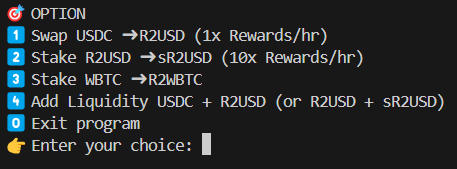

# R2 Smart Contract AutoBot

A Python bot to automatically interact with smart contracts on the Ethereum Sepolia testnet.

## 🚀 Features

- Swap USDC → R2USD (1x Rewards/hr)
- Stake R2 → sR2USD (10x Rewards/hr)
- Stake WBTC → R2WBTC
- Add liquidity: USDC → R2USD (10x Rewards/hr)
- Add liquidity: R2USD → sR2USD (20x Rewards/hr)
- Get price data from API



## 🔧 Installation

1. Clone the repository:

```bash
git clone https://github.com/duybinhhh/R2-testnet-auto-bot.git
cd R2-testnet-auto-bot
```

2. Install dependencies:

```bash
pip install -r requirements.txt
```

3. Setup environment variables:

```bash
cp .env.example .env
```

Then open the `.env` file and fill in your `PRIVATE_KEY`, wallet `ADDRESS`.

## ▶️ Running the bot

```bash
python cli/main.py
```

## 🛡 Prerequisites

- Python 3.10+
- Ethereum Sepolia testnet access (RPC, wallet, etc.)

## ⚠️ Warning

> Never share your `.env` file or expose your `PRIVATE_KEY`.  
> Treat your private keys like passwords.

## ☕ Buy Me a Coffee

EVM: 0x43946901a5533d3Fe0B16e94d09AF05c113b14a6

SOL: 29bpksBWKT4gbdNzbMMFYHUEQfxdJt1v73TB2KA3wswB

Thank you for visiting this repository! 🌟

Don't forget to contribute by following and starring ⭐️.

If you have questions, suggestions, or issues, feel free to contact me or open an issue.

## ⚠️ Disclaimer

**This project is intended for educational purposes only.  
It does **not** constitute financial, investment, or legal advice.  
Use at your own risk. The author is not responsible for any damages or losses.**

## 📄 License

MIT License

**DUYBINH**
